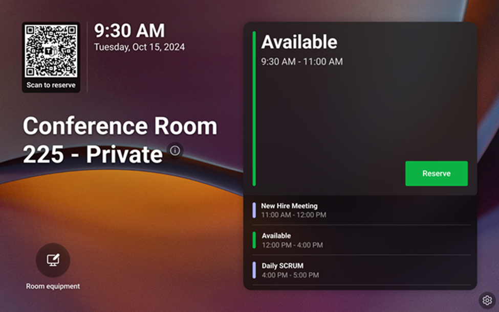
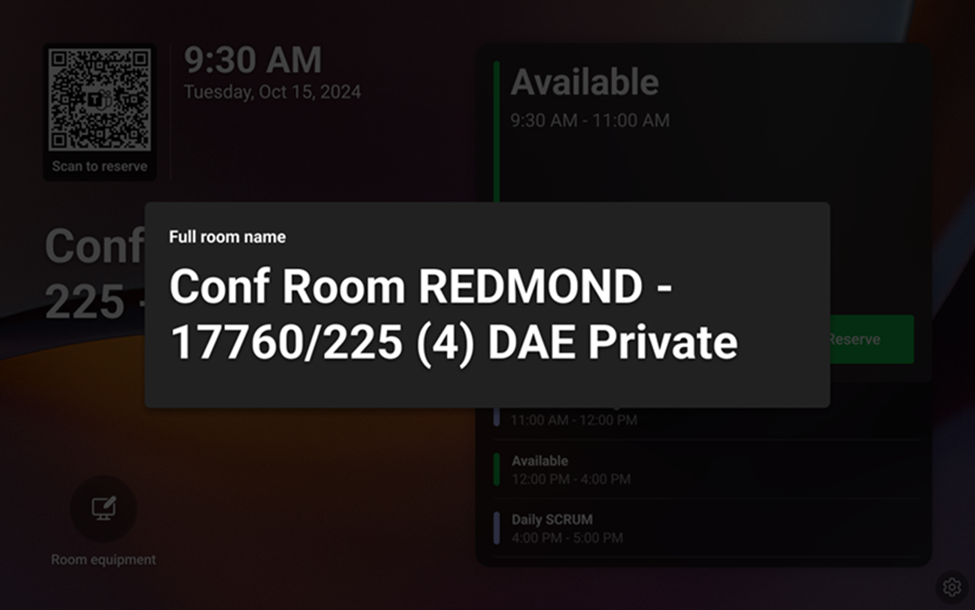

# Add a custom name for Teams panels
  
You can now customize the display name for your Teams panel. For example, you can shorten the name to something that is more easily readable for your users.  

To use custom names, it depends on the version of Teams panels app installed and the license of the account that is signed in to that device:

- Verify the Teams panel is running on version 1449/1.0.97._____ or later.

- Verify the account signed in on your Teams panel device is assigned a Teams Rooms Pro or Teams Shared Devices license.

To set up and manage custom names for your Teams panels:

1. Sign in to the __Teams Rooms Pro Management Portal__.

1. Go to __Inventory__ > __Planning__ > select a room account where you’d like to apply a custom name to > and fill in the __custom name field.__ By default, this field will be filled with the name that is shown in the Global Address Book (GAL).

1. Select __Save.__

Please note that the custom name will be displayed on the Teams panel home screen, so we recommend making sure it is clear and understandable to your users. In addition, please note that this will not change the display name shown on Microsoft Teams Rooms if you have one inside of the room.

Within 24 hours of the custom name being updated to a name other than the GAL one, the Teams panel home screen will reflect the new name. The home screen will also have a tooltip that, when selected, will show the user the GAL name.

  
In Teams admin settings, an admin can view the GAL name and custom name if one has been applied under __Device settings__ > __Display name__. It is not possible to edit the name in these admin settings. Editing can only be done in the Teams Rooms Pro Management Portal. 

If you would like to remove the new custom name, you can simply remove the custom name in the custom name field in the Teams Rooms Pro Management Portal, and the display name on Teams panel will default back to the GAL name.

## Related articles

- [Insert link text](/powershell/module/teams/new-csteamsipphonepolicy)
- [Plan for Teams panels](/microsoftteams/devices/teams-panels)
- [Certified Teams panels](teams-panels-certified-hardware.md)
